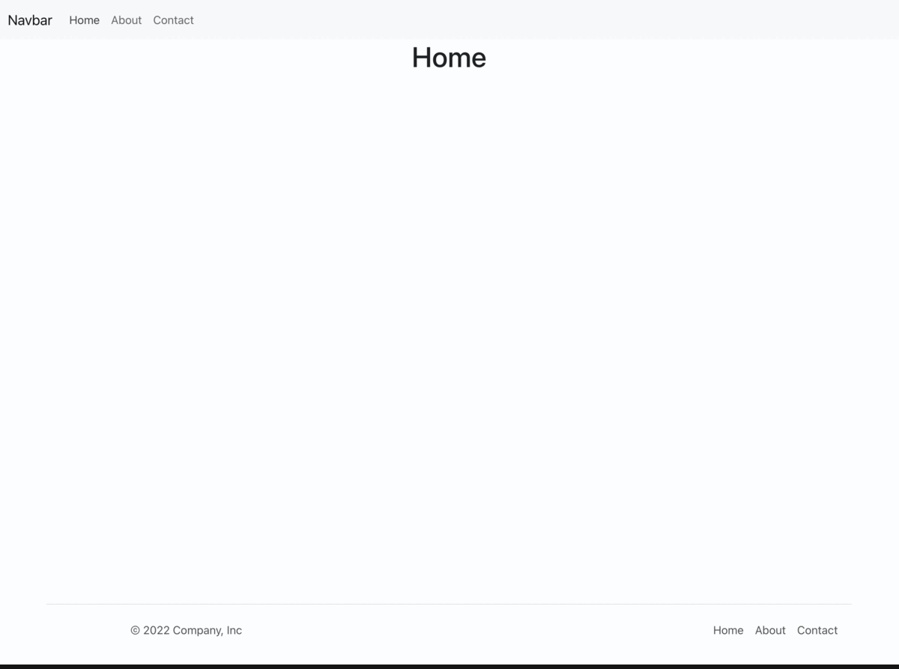

# Introduction: Routing in a Single Page Application with React Router



We are going to cover everything you need to know to get started with React Router.

- Setting up the project
- What is routing?
- Setting up the router
- Rendering routes
- Using links to switch pages
- Final Thoughts
- Next Steps
- Assignments and resources

## Setting up the project

To be able to follow along, you will need to create a new React app by running the following command in your terminal:

```
npx create-react-app router-demo
```

Then, if you're ready to go, let's start by answering an important question: what is routing?

## What is routing?

Routing is the capacity to show different pages to the user. That means the user can move between different parts of an application by entering a URL or clicking on an element.

As you may already know, by default, React comes without routing. And to enable it in our project, we need to add a library named [react-router-dom](https://www.npmjs.com/package/react-router-dom).

To install it, you will have to run the following command in your terminal:

```
npm install react-router-dom
```

Now, we've successfully installed our router, let's start using it in the next section 🙂

## Setting up the router

To enable routing in our React app, we first need to import BrowserRouter from react-router-dom.

In the index.js file, enter the following:

```JSX
import React from "react";
import ReactDOM from "react-dom/client";
import "./index.css";
import App from "./App";
import reportWebVitals from "./reportWebVitals";
import { BrowserRouter } from "react-router-dom";
const root = ReactDOM.createRoot(document.getElementById("root"));
root.render(
  <React.StrictMode>
    <BrowserRouter>
      <App/>
    </BrowserRouter>
  </React.StrictMode>
);

// If you want to start measuring performance in your app, pass a function
// to log results (for example: reportWebVitals(console.log))
// or send to an analytics endpoint. Learn more: https://bit.ly/CRA-vitals
reportWebVitals();


```

This should hold everything in our app where routing is needed. That means, if we need routing in our entire app, we must wrap our App component with BrowserRouter.

A router alone doesn't do much. So let's add a route in the next section.

## Rendering routes

- Router: The router that keeps the UI in sync with the URL
- Link: Renders a navigation link
- Route: Renders a UI component depending on the URL

To render routes, we have to import the Route and Routes component from the router package.

In your App.js file, add the following code:

```JSX
import "./App.css";
import { Routes, Route } from "react-router-dom";
import About from "./components/Pages/About/About";
import Contact from "./components/Pages/Contact/Contact";
import Home from "./components/Pages/Home/Home";
import Navbar from "./components/Navbar/Navbar";
import Footer from "./components/Footer/Footer";

function App() {
  return (
    <div className="App">
      <Navbar />
      <main >
        <Routes>
          <Route path="/about" element={<About />} />
          <Route path="/contact" element={<Contact />} />
          <Route path="/" element={<Home />} />
          <Route path="*" element={<div>404</div>} />
        </Routes>
      </main>
      <Footer />
    </div>
  );
}

export default App;

```

Then, add it where we want to render the content. The Route component has several properties. But here, we just need path and element.

path: the path of the route. Here, we use / to define the path of the home page.

element: will display the content whenever the route is reached.

To get the full power of React Router, we need to have multiple pages and links to play with. We already have pages (components if you want, too), so now let's add some links so we can switch between pages.

## Using links to switch pages

To add links to our project, we will use the React Router again.

But first let's add bootstrap to our project [Get started with Bootstrap CDN links](https://getbootstrap.com/docs/5.2/getting-started/introduction/#cdn-links)

In your public/index.html file, add the following code:

```HTML
<!DOCTYPE html>
<html lang="en">
  <head>
    <meta charset="utf-8" />
    <link rel="icon" href="%PUBLIC_URL%/favicon.ico" />
    <meta name="viewport" content="width=device-width, initial-scale=1" />
    <meta name="theme-color" content="#000000" />
    <meta
      name="description"
      content="Web site created using create-react-app"
    />
    <link rel="apple-touch-icon" href="%PUBLIC_URL%/logo192.png" />
    <!--
      manifest.json provides metadata used when your web app is installed on a
      user's mobile device or desktop. See https://developers.google.com/web/fundamentals/web-app-manifest/
    -->
    <link
      href="https://cdn.jsdelivr.net/npm/bootstrap@5.2.0-beta1/dist/css/bootstrap.min.css"
      rel="stylesheet"
      integrity="sha384-0evHe/X+R7YkIZDRvuzKMRqM+OrBnVFBL6DOitfPri4tjfHxaWutUpFmBp4vmVor"
      crossorigin="anonymous"
    />

    <link rel="manifest" href="%PUBLIC_URL%/manifest.json" />
    <!--
      Notice the use of %PUBLIC_URL% in the tags above.
      It will be replaced with the URL of the `public` folder during the build.
      Only files inside the `public` folder can be referenced from the HTML.

      Unlike "/favicon.ico" or "favicon.ico", "%PUBLIC_URL%/favicon.ico" will
      work correctly both with client-side routing and a non-root public URL.
      Learn how to configure a non-root public URL by running `npm run build`.
    -->
    <title>React App</title>
  </head>
  <body>
    <noscript>You need to enable JavaScript to run this app.</noscript>
    <div id="root"></div>
    <!--
      This HTML file is a template.
      If you open it directly in the browser, you will see an empty page.

      You can add webfonts, meta tags, or analytics to this file.
      The build step will place the bundled scripts into the <body> tag.

      To begin the development, run `npm start` or `yarn start`.
      To create a production bundle, use `npm run build` or `yarn build`.
    -->
    <script
      src="https://cdn.jsdelivr.net/npm/bootstrap@5.2.0-beta1/dist/js/bootstrap.bundle.min.js"
      integrity="sha384-pprn3073KE6tl6bjs2QrFaJGz5/SUsLqktiwsUTF55Jfv3qYSDhgCecCxMW52nD2"
      crossorigin="anonymous"
    ></script>
  </body>
</html>

```

Now we ready to go.

Create components folder and and put the following folders and files.


Let's update the Navbar component
In your **components/Navbar/Navbar** file, add the following code:

**[Navbar Components (Documentation and examples for Bootstrap’s powerful, responsive navigation)](https://getbootstrap.com/docs/5.2/components/navbar/)**

```JSX

import React from "react";
import { Link } from "react-router-dom";

export default function Navbar() {
  return (
    <nav className="navbar navbar-expand-lg bg-light">
      <div className="container-fluid">
        <Link className="navbar-brand" to="/">
          Navbar
        </Link>
        <div className="collapse navbar-collapse" id="navbarNavAltMarkup">
          <div className="navbar-nav">
            <Link className="nav-link" to="/">
              Home
            </Link>
            <Link className="nav-link" to="/about">
              About
            </Link>
            <Link className="nav-link" to="/contact">
              Contact
            </Link>
          </div>
        </div>
      </div>
    </nav>
  );
}

```

Let’s add the pages

In your components/Pages/About file, add the following code:

```JSX
import React from "react";

export default function About() {
  return <h1>About</h1>;
}

```

In your components/Pages/Contact file, add the following code:

```JSX
import React from "react";

export default function Contact() {
  return <h1>Contact</h1>;
}

```

In your components/Pages/Home file, add the following code:

```JSX
import React from "react";

export default function Home() {
  return <h1>Home</h1>;
}

```

Let's update the Footer component

In your **components/Navbar/Footer** file, add the following code:

```JSX

import React from "react";
import { Link } from "react-router-dom";

export default function Footer() {
  return (
    <footer className="container d-flex flex-wrap justify-content-between align-items-center py-3 my-4 border-top">
      <p className="col-md-4 mb-0 text-muted">&copy; 2022 Company, Inc</p>

      <ul className="nav col-md-4 justify-content-end">
        <li className="nav-item">
          <Link to="/" className="nav-link px-2 text-muted">
            Home
          </Link>
        </li>

        <li className="nav-item">
          <Link to="/about" className="nav-link px-2 text-muted">
            About
          </Link>
        </li>

        <li className="nav-item">
          <Link to="/contact" className="nav-link px-2 text-muted">
            Contact
          </Link>
        </li>
      </ul>
    </footer>
  );
}

```

**After importing Link, we have to update our navigation bar a bit. Now, instead of using a tag and href, React Router uses Link and to to, well, be able to switch between pages without reloading it.**

## Final Thoughts

React Router is an amazing library that helps us go from a single page to a multi-page application feeling with great usability. (Just keep in mind – at the end of the day, it's still a single page app).

## Next Steps

Passing route parameters

---

## Assignments:

**Assignment:** [SPA-Router1](https://classroom.github.com/a/ldsTdEow)
**Solution:** [SPA-Router1]()

**Assignment:** [SPA-Router-band-landing-page](https://classroom.github.com/a/nx9HM6nJ)
**Solution:** [SPA-Router-band-landing-page]()

---

### Resources:

- [React Router DOM: How to handle routing in web apps](https://blog.logrocket.com/react-router-dom-tutorial-examples)
- [react-router](https://v5.reactrouter.com/web/guides/quick-start)
