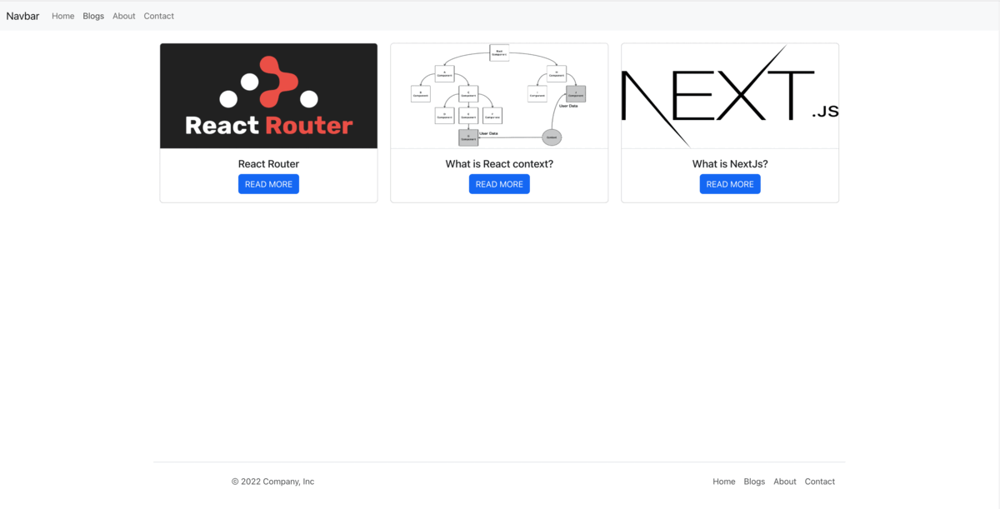
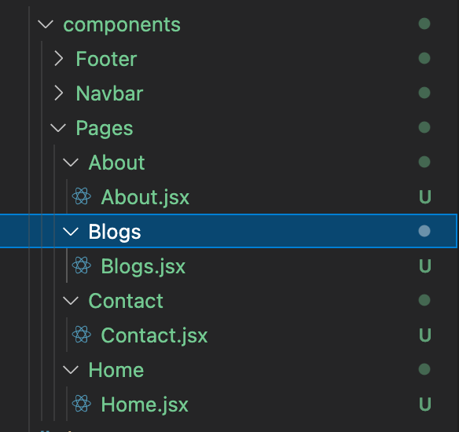
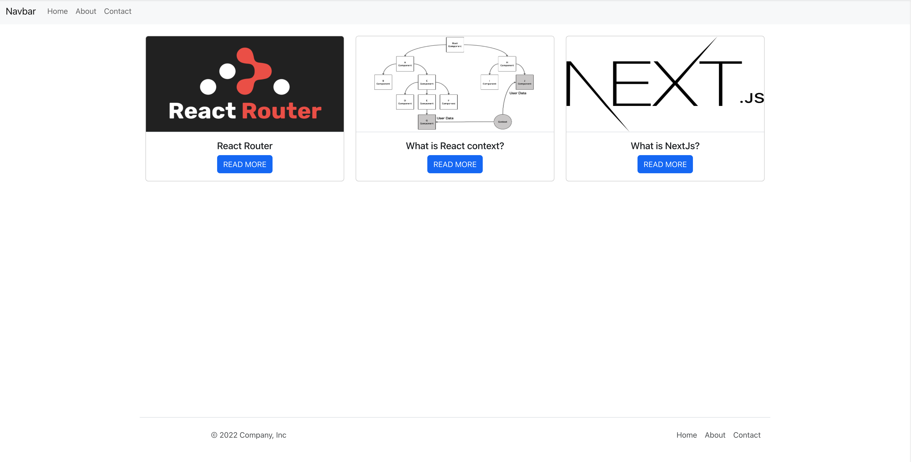
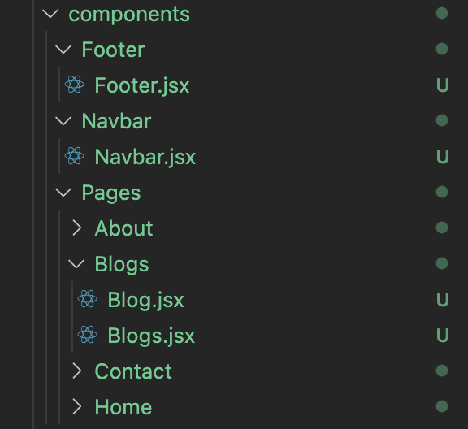

# Passing Route Parameters - Route Parameters (Dynamic Route)



In the previous section, we covered everything you need to know to get started with React Router.

You can find all the details [👉🏼here👈🏼](https://github.com/FbW-E10/SPA-Lessons/tree/main/6-Router/1-Introduction:%20Routing%20in%20a%20Single%20Page%20Application%20with%20React%20Router)

- Update our previous example
- What is a dynamic link?
- Passing route parameters
- Final Thoughts

## Passing route parameters

To pass data between pages, we have to update our previous example.

Let's create blogs section
In your App.js file, add the following code:

```JSX
import "./App.css";
import { Routes, Route } from "react-router-dom";
import About from "./components/Pages/About/About";
import Contact from "./components/Pages/Contact/Contact";
import Home from "./components/Pages/Home/Home";
import Navbar from "./components/Navbar/Navbar";
import Footer from "./components/Footer/Footer";

function App() {
  return (
    <div className="App">
      <Navbar />
      <main style={{ minHeight: "80vh" }}>
        <Routes>
          <Route path="/blogs" element={<div>blogs</div>} />
          <Route path="/about" element={<About />} />
          <Route path="/contact" element={<Contact />} />
          <Route path="/" element={<Home />} />

          <Route path="*" element={<div>404</div>} />
        </Routes>
      </main>
      <Footer />
    </div>
  );
}

export default App;


```

We just created a new route called blogs. Let's create the component, the page, and provide a link to this new page in the navbar and footer

In your components/Pages create new folder called Blogs and create Blogs.jsx `components/Pages/Blogs/Blogs.jsx`



Let's import the blogs component to App.jsx and assign it to the blogs route.

```JSX
import "./App.css";
import { Routes, Route } from "react-router-dom";
import About from "./components/Pages/About/About";
import Contact from "./components/Pages/Contact/Contact";
import Home from "./components/Pages/Home/Home";
import Navbar from "./components/Navbar/Navbar";
import Footer from "./components/Footer/Footer";
import Blogs from "./components/Pages/Blogs/Blogs";

function App() {
  return (
    <div className="App">
      <Navbar />
      <main style={{ height: "80vh" }}>
        <Routes>
          <Route path="/blogs" element={<Blogs />} />
          <Route path="/about" element={<About />} />
          <Route path="/contact" element={<Contact />} />
          <Route path="/" element={<Home />} />
          <Route path="*" element={<div>404</div>} />
        </Routes>
      </main>
      <Footer />
    </div>
  );
}

export default App;


```

In src folder create the following `src/api/blogs.js`

`blogs.js` is js file we put our fake api data nothing special and let's enter the following:

```JS
const blogs = [
  {
    id: "1234",
    title: "React Router",
    description:
      "React Router is the standard routing library for React. From the docs: “React Router keeps your UI in sync with the URL. It has a simple API with powerful features like lazy code loading, dynamic route matching, and location transition handling built right in.",
    image: "https://miro.medium.com/max/1200/0*nH627PKQdg4-BCfj",
  },

  {
    id: "6789",
    title: "What is React context?",
    description:
      "What is React context? React context allows us to pass down and use (consume) data in whatever component we need in our React app without using props. In other words, React context allows us to share data (state) across our components more easily.",
    image:
      "https://dev-yakuza.posstree.com/assets/images/category/react/2021/context-api/context.png",
  },

  {
    id: "77442",
    title: "What is NextJs?",
    description:
      "Next.js gives you the best developer experience with all the features you need for production: hybrid static & server rendering, TypeScript support, smart bundling, route pre-fetching, and more. No config needed.",
    image:
      "https://upload.wikimedia.org/wikipedia/commons/thumb/8/8e/Nextjs-logo.svg/1200px-Nextjs-logo.svg.png",
  },
];

export default blogs;


```

We can use the data from `api/blogs.js` to render our awesome blogs card powered by bootstrap.

In the Blogs.jsx file, enter the following:

```JSX

import React from "react";
import { Link } from "react-router-dom";
import blogsApi from "../../../api/blogs";

const Card = ({ id, title, image }) => {
  return (
    <div class="card">
      
      <div class="card-body border-top">
        <h5 class="card-title ">{title}</h5>

        <Link to={`/blog/${id}`} class="btn btn-primary">
          READ MORE
        </Link>
      </div>
    </div>
  );
};

export default function Blogs() {
  return (
    <div class="container mt-4">
      <div class="row">
        {blogsApi.map((blog) => (
          <div class="col" key={blog.id}>
            <Card {...blog} />
          </div>
        ))}
      </div>
    </div>
  );
}


```

Now we have awesome blogs card with dynamic links but what is a dynamic link?



## What is a dynamic link?

Dynamic Links are smart URLs that allow you to send existing and potential users to any location within your website.

Checkout the Card component:

```JSX

const Card = ({ id, title, image }) => {
  return (
    <div class="card">
      
      <div class="card-body border-top">
        <h5 class="card-title ">{title}</h5>

        <Link to={`/blog/${id}`} class="btn btn-primary">
          READ MORE
        </Link>
      </div>
    </div>
  );
};

```

Here the dynamic link:

```JSX

<Link to={`/blog/${id}`} class="btn btn-primary">
  READ MORE
</Link>

```

But if you click on those dynamic links you send to a 404 page. How we can display the blog details instead of 404 🤔

We can achieve that by passing route parameters. But I forgot to add the links to the navbar and the footer, let’s do this together.

In the Navbar.jsx file, enter the following:

```JSX

import React from "react";
import { Link } from "react-router-dom";

export default function Navbar() {
  return (
    <nav className="navbar navbar-expand-lg bg-light">
      <div className="container-fluid">
        <Link className="navbar-brand" to="/">
          Navbar
        </Link>
        <div className="collapse navbar-collapse" id="navbarNavAltMarkup">
          <div className="navbar-nav">
            <Link className="nav-link" to="/">
              Home
            </Link>
            <Link className="nav-link" to="/blogs">
              Blogs
            </Link>
            <Link className="nav-link" to="/about">
              About
            </Link>
            <Link className="nav-link" to="/contact">
              Contact
            </Link>
          </div>
        </div>
      </div>
    </nav>
  );
}


```

In the Footer.jsx file, enter the following:

```JSX

import React from "react";
import { Link } from "react-router-dom";

export default function Footer() {
  return (
    <footer className="container d-flex flex-wrap justify-content-between align-items-center py-3 my-4 border-top">
      <p className="col-md-4 mb-0 text-muted">&copy; 2022 Company, Inc</p>

      <ul className="nav col-md-4 justify-content-end">
        <li className="nav-item">
          <Link to="/" className="nav-link px-2 text-muted">
            Home
          </Link>
        </li>

        <li className="nav-item">
          <Link to="/blogs" className="nav-link px-2 text-muted">
            Blogs
          </Link>
        </li>

        <li className="nav-item">
          <Link to="/about" className="nav-link px-2 text-muted">
            About
          </Link>
        </li>

        <li className="nav-item">
          <Link to="/contact" className="nav-link px-2 text-muted">
            Contact
          </Link>
        </li>
      </ul>
    </footer>
  );
}


```

## Passing route parameters

In the App.js file, enter the following:

```JSX
import "./App.css";
import { Routes, Route } from "react-router-dom";
import About from "./components/Pages/About/About";
import Contact from "./components/Pages/Contact/Contact";
import Home from "./components/Pages/Home/Home";
import Navbar from "./components/Navbar/Navbar";
import Footer from "./components/Footer/Footer";
import Blogs from "./components/Pages/Blogs/Blogs";

function App() {
  return (
    <div className="App">
      <Navbar />
      <main style={{ height: "80vh" }}>
        <Routes>
          <Route path="/blogs" element={<Blogs />} />
          <Route path="/about" element={<About />} />
          <Route path="/contact" element={<Contact />} />
          <Route path="/blog/:id" element={<div>blog</div>} />

          <Route path="/" element={<Home />} />
          <Route path="*" element={<div>404</div>} />
        </Routes>
      </main>
      <Footer />
    </div>
  );
}

export default App;


```

Let’s discuss this strange syntax:

```JSX
  <Route path="/blog/:id" element={<div>blog</div>} />

```

**Params are placeholders in the URL that begin. The route in this example. A similar convention is used for matching dynamic segments in other popular web frameworks like Rails and Express.**

Now let's create Blog component inside Blogs folder. And import this component and assign it to `<Route path="/blog/:id" element={<div>blog</div>} />`

In the `components/Blogs/Blog.jsx` file, enter the following:

```JSX
import React from "react";
import { useParams } from "react-router-dom";

export default function Blog() {
  let { id } = useParams();
  return <div>{id}</div>;
}

```

We can use the `useParams` hook here to access the dynamic pieces of the URL.

Let's use this new component (Blog.jsx)

In the App.js file, enter the following:

```JSX

import "./App.css";
import { Routes, Route } from "react-router-dom";
import About from "./components/Pages/About/About";
import Contact from "./components/Pages/Contact/Contact";
import Home from "./components/Pages/Home/Home";
import Navbar from "./components/Navbar/Navbar";
import Footer from "./components/Footer/Footer";
import Blogs from "./components/Pages/Blogs/Blogs";
import Blog from "./components/Pages/Blogs/Blog";

function App() {
  return (
    <div className="App">
      <Navbar />
      <main style={{ height: "80vh" }}>
        <Routes>
          <Route path="/blogs" element={<Blogs />} />
          <Route path="/about" element={<About />} />
          <Route path="/contact" element={<Contact />} />
          <Route path="/blog/:id" element={<Blog />} />

          <Route path="/" element={<Home />} />
          <Route path="*" element={<div>404</div>} />
        </Routes>
      </main>
      <Footer />
    </div>
  );
}

export default App;

```



Now if you click on the smart links in the blogs you send to blog page and see the id.

You can use this id to target the blog object from `api/blogs.js` array.

Let's use this id to get the blog object and display the data in jsx.

In the Blog.js file, enter the following:

```JSX
import React, { useEffect, useState } from "react";
import { useParams } from "react-router-dom";
import blogsApi from "../../../api/blogs";

export default function Blog() {
  let { id } = useParams();
  const [blog, setBlog] = useState();

  useEffect(() => {
    const findBlog = blogsApi.find((item) => item.id === id);
    setBlog(findBlog);
  }, [id]);

  return blog ? (
    <div class="container mt-4 mb-4">
      <h1>{blog.title}</h1>
      </img>
      <p class="mt-4 mb-4">{blog.description}</p>
    </div>
  ) : (
    <div>Loading....</div>
  );
}

```

Awesome, now we have dynamics routes

## Final Thoughts

We've done a lot up to this point. And now with router hooks, you can see how easy and elegant they are. They're definitely something to consider in your next project.

---

## Join a lesson:

**Join the live-coding (codesandbox):**

---

## Assignments:

**Assignment:** [SPA-router-dog-finder](https://classroom.github.com/a/9It-6VA2)
**Solution:** [SPA-router-dog-finder]()

**Assignment:** [SPA-CreateBlog](https://classroom.github.com/a/bi7vW7Js)
**Solution:** [SPA-CreateBlog]()

---

### Resources:

- [React Router V6 Tutorial - Routes](https://www.youtube.com/watch?v=UjHT_NKR_gU)
- [React Router DOM: How to handle routing in web apps](https://blog.logrocket.com/react-router-dom-tutorial-examples)
- [react-router](https://v5.reactrouter.com/web/guides/quick-start)
