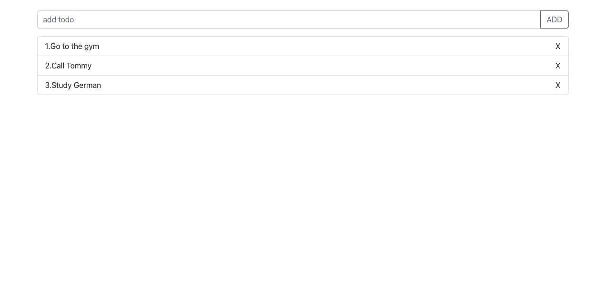

# Basic State Management Concepts

State Management is a very complex topic. All Frontend Developers know that. They ask themselves, what is the best approach to share and manage a state between components.

There are not only many external state management libraries (such as the most popular Redux) but also React already has built-in state management. It makes the decision even more difficult.

**Here are some questions you should ask yourself before you decide which state management approach is the best choice for you:**

- Do I even need State Management?
- What are State and Props?
- Which solution is best for my use case?

## Do I even need State Management

Unfortunately there is no simple answer for that. It depends on how big and complex your application is and how experienced you are in using React.

If your application is not too big and complex but rather small and pretty, you do not have to make it unnecessarily complicated. For many use cases, you do not need any state management library at all.

## What are State and Props?

What do the state and props have in common? They are deterministic and trigger a render update once they change. Deterministic means if your component generates different outputs for the same combination of state and props, you are doing something wrong.

**What is a state?** Let’s take a checkbox as an example. A checkbox has two states- true and false. If a user checks a checkbox, its status will change. This status is called state.

**What are props?** You can think of props as a (kind of) configuration. The props are provided by the parent components. Let’s take our previous example, a checkbox: It can be configurable, for example, it can have a name or a color. These are the props. The props are immutable. This means that the component cannot change it.

## Which solution is best for my use case?

**1 - Redux:**
Redux is a predictable state container designed to help you write JavaScript apps that behave consistently across client, server, and native environments and are easy to test.

With Redux, the state of your application is kept in a store, and each component can access any state that it needs from this store.

**2 - useContext & useReducer:**
React also offers its own solution for implementing the state management — without any external libraries such as Redux. This solution is called Context.

Context shares data between a group of components that need the same data. This means that there is no need to manually pass the props to each tree level.

useContext & useReducer Pattern:

is no extra library, everything is based on React
is very flexible but you have to implement some patterns by yourself

## Next Step

useContext API

---

---

## Assignments:

**Assignment:** setup and start your portfolio in react

---

### Resources:

- [An Introduction to State Management in React](https://javascript.plainenglish.io/state-management-in-react-48d16d162442)

- [React Project Tutorial – Build a Portfolio Website w/ Advanced Animations](https://www.youtube.com/watch?v=bmpI252DmiI&t=49s)
