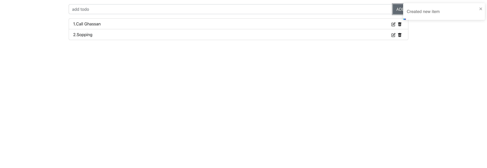

# Context API



# State Management in SPAs

Is the approach of having one single source of state for the entire app to which all the components can have direct access.
This approach is meant to reduce the amount of code and confusion that is a part of passing props down to children components and grandchildren components.

## Context API

The React Context API is a **state management tool** that allows us to effectively produce global state variables and controllers functions that can be passed around. This is the alternative to _"prop drilling"_ or moving props from grandparent to child to parent, and so on. Context is also regarded as an easier, lighter approach to state management than other tools such as **Redux**.

Context API is a (kind of) new feature added in version 16.3 of React that allows one to share state across the entire app (or part of it) lightly and with ease.

## How Context works

React.createContext() is all you need. It returns a provider . **Provider** is a component that as it's names suggests provides the _global state_ to its children. It will hold the "store" and be the parent of all the components that might need that store.
We can then access the provided Store from any child component using a hook called **useContext( )**

---

## Creating and using Context & Provider

```js
import React, { useState } from "react";
import { toast } from "react-toastify";

const Context = React.createContext();

export function ContextProvider(props) {
  const [todos, setTodos] = useState([]);
  const [editTodo, setEditTodo] = useState(null);
  const onAddTodo = (todo) => {
    setTodos([...todos, todo]);
    toast("Created new item");
  };
  const onDeleteTodo = (index) => {
    const newTodos = todos.filter((_, i) => i !== index);
    setTodos(newTodos);
    toast("Deleted item");
  };

  const onEditTodo = (index) => {
    const findTodo = todos.find((_, i) => i === index);
    setEditTodo({ index, value: findTodo });
  };

  const onEditHandler = (e) => {
    e.preventDefault();
    const newValue = e.target.todo.value;
    const newTodos = todos.map((item, index) => {
      if (index === editTodo.index) {
        return newValue;
      } else {
        return item;
      }
    });
    toast("Edited item");
    setTodos(newTodos);
    setEditTodo(null);
  };

  return (
    <Context.Provider
      value={{
        todos,
        setTodos,
        editTodo,
        setEditTodo,
        onAddTodo,
        onEditHandler,
        onEditTodo,
        onDeleteTodo,
      }}
    >
      {props.children}
    </Context.Provider>
  );
}

export default Context;
```

**ContextProvider should cover App.js**

```js
import React from "react";
import ReactDOM from "react-dom/client";
import "./index.css";
import App from "./App";
import reportWebVitals from "./reportWebVitals";
import "react-toastify/dist/ReactToastify.css";
import { ContextProvider } from "././store/context";
const root = ReactDOM.createRoot(document.getElementById("root"));
root.render(
  <React.StrictMode>
    <ContextProvider>
      <App />
    </ContextProvider>
  </React.StrictMode>
);

// If you want to start measuring performance in your app, pass a function
// to log results (for example: reportWebVitals(console.log))
// or send to an analytics endpoint. Learn more: https://bit.ly/CRA-vitals
reportWebVitals();
```

we are ready to access the store in any component.

Access within App.js

- import useContext from react
- import Context from the store
- pass Context to useContext ` const { editTodo } = useContext(Context);`

```js
import "./App.css";
import Form from "./components/Form";
import ListGroup from "./components/ListGroup";
import Modal from "./components/Modal";
import { ToastContainer } from "react-toastify";
import { useContext } from "react";
import Context from "./store/context";

function App() {
  const { editTodo } = useContext(Context);
  return (
    <div className="container mt-4 w-20">
      <Form />
      <ListGroup />
      {editTodo && <Modal />}
      <ToastContainer />
    </div>
  );
}

export default App;
```

---

## Assignments:

**Assignment:** setup and start your portfolio in react

---

### Resources:

- [An Introduction to State Management in React](https://javascript.plainenglish.io/state-management-in-react-48d16d162442)

- [react-toastify](https://www.npmjs.com/package/react-toastify)
- [react-icons](https://react-icons.github.io/react-icons)
