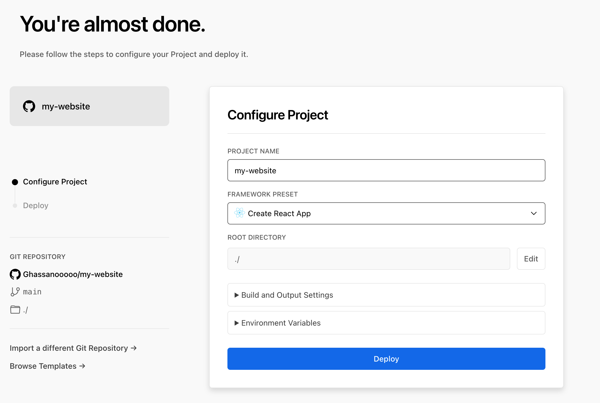

# Deployment 1 Day (15.06.2022)

**The Easiest Way to Deploy a React App**

Would you believe that you can deploy your React app to the internet from scratch in minutes? That may sound like the tagline for a too-good-to-be-true advertisement but it is really possible with Vercel.

**Deploy React to Vercel**

Vercel is a platform for deploying the fastest React sites. You can deploy your site with zero configuration to the best frontend infrastructure. **With Vercel you can deploy up to five apps for free**.

- Develop: Build React sites that connect to your favorite APIs, databases, and content management systems.

- Preview: Integrate with any GitHub, GitLab, or Bitbucket repository for instant continuous deployment.

- Ship: Deploy your site to every edge node worldwide for the fastest React sites. Static files, Serverless and Edge Functions, and more.

- Monitor: Measure Core Web Vitals from actual devices your visitors are using with Vercel Analytics for Next.js or Gatsby.

**Built-in CI/CD for React sites**
Vercel has integrations for GitHub, GitLab, and Bitbucket to enable CI/CD for your React site with zero configuration. Then, you can run automated tests for performance and reliability on every push. Pull and merge requests are deployed instantly to a unique URL, accessible to your entire team.

**Add your custom domain**

After deploying, your new React site will automatically be assigned a .vercel.app suffixed domain. You can then add a Custom Domain on your choice, either from a third-party or purchased through Vercel.

## How to Deploy a React Site with Vercel?

**1- Create GitHub repository in your GitHub account and push your code to it**

**2- Sign up/in [vercel](https://vercel.com)**

 
 

**3- Create [new project](https://vercel.com/new) in vercel**

**4- Connect vercel with your GitHub account**

**5- Select your repository**
 
 
 
 **6- Deploy**

 
 
---

### Resources:

- [Deploy React to Vercel](https://vercel.com/guides/deploying-react-with-vercel#deploy-react-to-vercel)
